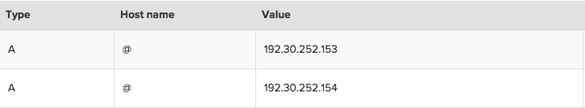
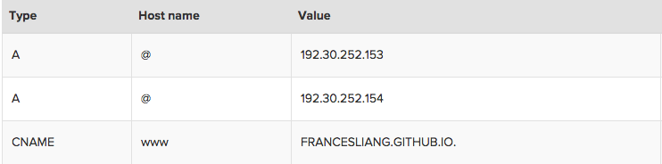

This is the first time that I tried to write a personal tech blog and the first time that I tried to build a blog from scratch. So I was thinking to write a post as a record of how I did it. Even though there are lots of website templates out there for people to choose and you can probably use one of those that people share on their GitHub for free, I feel more satisfied by building the blog on my own. Plus, it is a great opportunity for me to learn about web development as a beginner.

Before actually buidling the blog, I need to consider what type of web pages I would like to build. Generally, there are two - static and dynamic. Static web pages deliver to the user with the same prebuilt content each time the page is loaded. They have the same structure and content unless the web developer updates and publishes new changes. In contrast, dynamic web pages are generated by a web-application. These pages have server-side scripts which are processed by the application server to generate unique conten every time the page is loaded. As for a personal blog, its implementation is on a small scale without many pages required, it doesn't need to be generated on-the-fly and I will be the only one who manages and updates the website; therefore, a static web page is more suitable for my need.

The other thing that I would like for my blog is a custom URL. I got my domain name free through attending a start-up weekend, so I will skip the detail of this step. But it wouldn't be hard to get a custom domain name from many domain name registrars in the market.

Once I've decided what type of website I would like to develop and got my custom domain name, I can now actually start building my blog. Here are the components of this blog:

* [Blog Hosting - GitHub Pages](#blog-hosting)

* [Blog Design - Bootstrap](#blog-design)

* [Blog Comment - Disqus](#blog-comment)

* Static Site Generator - Jekyll

* Continous Integration - Travis

I will discuss the last two components in the following article as the second part of this post.

<br>

#### <a name="blog-hosting"></a>Blog Hosting - GitHub Pages

<br>
**Generate a Site**

First of all, the blog needs to be hosted through a web hosting service, so that the webiste is accessible via the Internet. I use [GitHub Pages](https://pages.github.com/), because it's free and I was going to commit the files for this blog to [my GitHub](https://github.com/francesliang/francesliang.github.io) anyway. If you are not familiar with GitHub then [here](https://github.com/) is their website. 

As the [instructions](https://pages.github.com/) mentioned on GitHub Pages, the followings are the steps to create a site:  

1. Create a new repository named "*username*.github.io" on your GitHub, where *username* is your username on GitHub.

2. Clone the repository to the folder where you want to store your project locally on your computer:

	```
	~$ git clone https://github.com/username/username.github.io
	```

3. Create an *index.html* (the default web page) and add other files related to your project in the project folder.

4. Add, commit, and push your changes in the project folder to GitHub using the following commands:

	```
	~$ git add --all  
	```
	
	```	
	~$ git commit -m "Initial commit" 
	``` 

	```
	~$ git push -u origin master 
	``` 

5. Now you have generated your webiste: "*http://username.github.io*".

**Customise URLs**

You may notice that the URL of the website you just created is "*http://username.github.io*". In order to use a custom URL, we need to [set up the custom domain with GitHub Pages](https://help.github.com/articles/setting-up-a-custom-domain-with-github-pages/):  

1. Create a CNAME file that contains the custom domain (the content of the file is: "*yourdomain.com*") to your repository's root directory (in your repository's Pages branch). Then commit and push the file. This is to redirect your GitHub Pages site using your custom domain.  

2. Configure a custom apex domain (e.g. *yourdomain.com*) -  for the root apex (@) to point to *username.github.io*

	+ With your DNS provider, create A records (in the DNS manager) that point to the following IP address:

		- 192.30.252.153

		- 192.30.252.154

		

	+ If your DNS provider supports ALIAS records or ANAME records, then you may choose to create an ALIAS or ANAME record and point it to *username.github.io* instead.  

3. Configure a custom subdomain (e.g. *www.yourdomain.com*) - for www. to point to *username.github.io*

	+ In your DNS manager, create a CNAME record and point it to *username.github.io*. See the following as an example:

	

4. Check if your name server has been updated using the *dig* command:

	```
	~$ dig *yourdomain.com* +nostats +nocomments +nocmd
	```

If the congifuration is successful, you should be able to access to your webiste through both *yourdomain.com* and *www.yourdomian.com*.

<br>

#### <a name="blog-design"></a>Blog Design - Bootstrap

<br>
Once the website of my blog is up and running, it's time for the actual design of what to write on the bloc and what the blog should look like. Basically, there are two main parts of a website - what you read (content) and what it looks like (style).

**HTML and CSS**

[HyperText Markup Language (HTML)](http://www.w3schools.com/html/html_intro.asp) is used to construct the strucutre and the content, like the skeleton, of a website. Each website can be devided into many blocks of different sizes, which is similar as a grid system. [HTML elements](https://en.wikipedia.org/wiki/HTML_element), which consist of HTML tags, put those blocks together like a puzzle to form the basic structure of a website. In each block, the content, such as text and image, is also described in HTML. These HTML files can be read by web browsers and be rendered into a readable web page for audiences.

Even though the basic layout and content is created, it still won't be much pleasant to read with just black text and white background. [Cascading Style Sheets (CSS)](http://www.w3schools.com/css/css_intro.asp) is used to define styles of a website and make it look pretty - the presentation of a web page. It includes the design, layout, colours, fonts, etc. The CSS files are normally stored sperately from the HTML files; therefore the style defined in a CSS file can be applied to the content of many web pages, and vice versa, the same web page can have many different styles by implmenting different CSS files.

**Bootstrap**

Since a web page has so many components, such as tables, buttons, and responsive utilities, some kind of templates would be useful to implement and re-use those components, instead of coding from scratch. To do so, I use Bootstrap for this blog. Bootstrap is a free and open-source front-end framework, which has a collection of tools for web applications. It contains both HTML and CSS based design templates. There are three major parts of the library:

+ CSS - layout and style etc.

+ Components - glyphicons, dropdowns, button gourps, navigation, alerts and so on

+ JavaScript - a programming language for the functions of a web page

Boostrap can be downloaded [*here*](http://getbootstrap.com/getting-started/#examples) with instructions of how to use the framework. Basically, you just need to put the download folders in the same directory as your *index.html* file and include the following codes in the header of the HMTL file

1. CSS sytle sheet:

```
<link href="css/bootstrap.min.css" rel="stylesheet">
```

2. JavaScript plugins and its necessity - jQuery:

```
<script src="https://ajax.googleapis.com/ajax/libs/jquery/1.11.3/jquery.min.js"></script>
```

```
<script type="text/javascript" src="/js/bootstrap.min.js"></script>
```

You could also include Bootstrap from a CDN (Content Delivery Network) without downloading and hosting Bootstrap yourself. MaxCDN provides CDN support for Bootstrap's CSS and JavaScript; therefore, you just need to include the following links in your HTML file:

```
<!-- Latest compiled and minified CSS -->
<link rel="stylesheet" href="https://maxcdn.bootstrapcdn.com/bootstrap/3.3.5/css/bootstrap.min.css">
```

```
<!-- jQuery library -->
<script src="https://ajax.googleapis.com/ajax/libs/jquery/1.11.3/jquery.min.js"></script>
```

```
<!-- Latest compiled JavaScript -->
<script src="http://maxcdn.bootstrapcdn.com/bootstrap/3.3.5/js/bootstrap.min.js"></script>
```

**Font Awesome**

Another toolkit that is widely used on web pages is [*Font Awesome*](https://fortawesome.github.io/Font-Awesome/). It is a font and icon toolkit based on CSS. Icons such as facebook, twitter, github and email can be added to your website anywhere with the *<i> tag* (see example [*here*](https://fortawesome.github.io/Font-Awesome/examples/)).

The easiest way to set up Font Awesome is using BootstrapCDN by MaxCDN (see [*here*](https://fortawesome.github.io/Font-Awesome/get-started/)). The code to be included in the header of your site's HTML is as following:

```
<link rel="stylesheet" href="https://maxcdn.bootstrapcdn.com/font-awesome/4.4.0/css/font-awesome.min.css">
```


**Favicon**

A favicon (Favourite icon, also known as a shortcut icon) is the icon or the small image that you can see next to the website's title on the tab or the URL in the address bar of a browser. It is usually an image with 16x16 pixels. You could generate a favicon through many website, such as [*this one*](http://www.favicon-generator.org/).

To add a favicon to a static HTML page, simply save the *favicon.ico* file in the root directory of your website, and include the following in the header of the HTML file:

```
<link rel="shortcut icon" href="/favicon.ico" type="image/x-icon">
```

**Google Fonts**


<br>

#### <a name="blog-comment"></a>Blog Comment - Disqus

<br>


