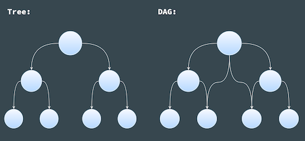
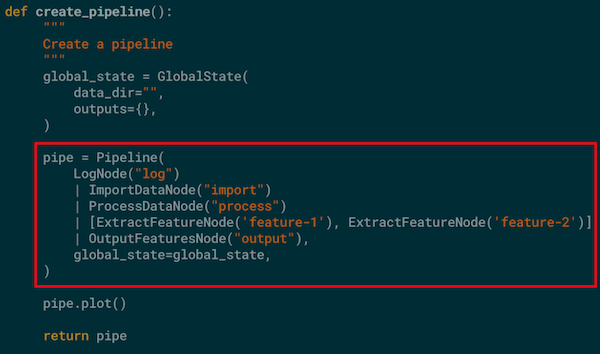
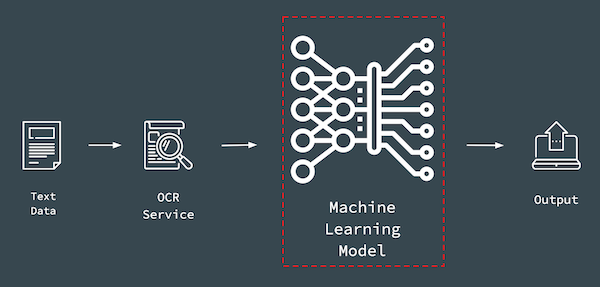
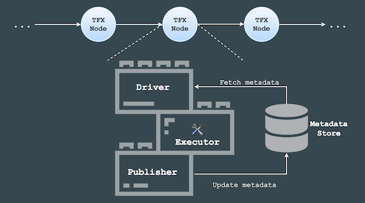
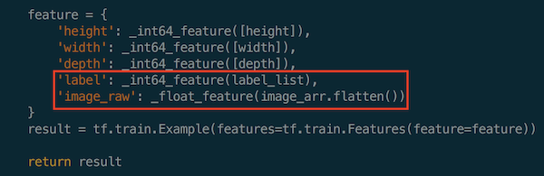
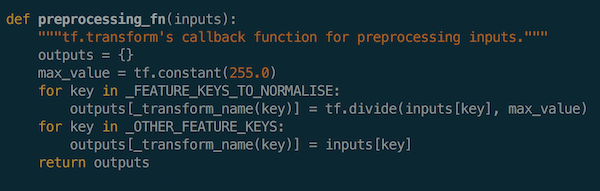
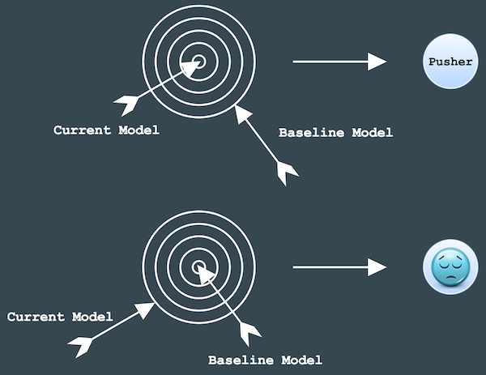

#### Contents

+ [Directed Acyclic Graph](#directed-acyclic-graph)

+ [Task-aware Pipeline](#task-aware-pipeline)

    + [Consecution](#consecution)

+ [Task and Data-aware Pipeline](#task-and-data-aware-pipeline)

    + [TensorFlow Extended](#tensorflow-extended)

+ [Conclusions](#conclusions)

Machine learning projects usually involves the following three main components:

* a dataset for machines to learn and find patterns from

* algorithms written as codes to instruct machines to learn and identify patterns

* model files as a result of the above two to identify patterns or do predictions on future data input

 

 

Even though these three components don't seem to be overly complicated, there are many moving pieces underneath each component;

Before the algorithms can be run on the dataset, the data has to go through:

* Data import

* Data cleansing

* Data formatting

* Definition of data schema

* Data processing

Once the data has been processed, it reaches the stage of model development, which includes:

* Iterative model training

* Model evaluation

* Model validation

Then a fully-developed model will go through the followings before it can be useful at pattern identification on future input data in the real world:

* Model inference

* Model deployment

Without a structured pipeline for machine learning projects, the pieces required as mentioned above are like a set of puzzle pieces scattered all over the place:

 

 

It would be nice if a structure is in place to put all the puzzle pieces together in a particular order, so that we don't need to repeat the arrangement process during iterative model development, instead the structure can be set-up and re-used quickly, like this:

 

 

This is why a pipeline is necessary for machine learning projects, so that the infrastructure of the development process is reproducible and we don't have to repeat ourselves.

A pipeline consists of a chain of processing elements, arranged in a particular order so that the output of each element is the input of the next. Therefore, data or information can flow through the pipeline from one end to the other. The structure of such a pipeline is called Directed Acyclic Graph (DAG). 

 

#### Directed Acyclic Graph

 

A directed acyclic graph is

> a finite directed graph with no directed cycles, It consists of finitely many vertices and edges (also called arcs), with each edge directed from one vertex to another, such that there is no way to start at any vertex v and follow a consistently-directed sequence of edges that eventually loops back to v again. 

Essentially, a directed acyclic graph is:

* a graph - a structure consisting of nodes that are connected to each other with edges

 

    
 

* directed - the connections between the nodes, i.e edges, have a direction, so that going from node A to B is not the same as going from node B to A

 

    
 

* acyclic - non-circular, moving from node to node by following the edges, you will never encounter the same node for the second time 

 

 

A Directed Acyclic Graph (DAG) is similar to a tree data structure, they both:

* are a graph

* have a root node

* are connected and directed

* have no circle 

The difference between these two structure is that:

 

 

* Each node in a tree can only have one parent node; therefore, only one path between two nodes in a tree

* Each node in a DAG can one or more than one parent nodes; therefore, there is one or more paths between two nodes in a DAG

Directed Acyclic Graph is the foundation of pipeline structure. In the context of machine learning pipelines, a Directed Acyclic Graph is a collection of all the tasks to be run, organised in a way that reflects their relationships and dependencies. Due to the nature of pipeline functionality, there are two main types of pipelines in machine learning projects:

1. Task-aware pipeline

2. Task and data-aware pipeline

 

#### Task-aware Pipeline

 

A task-aware pipeline is to kick off the next stage of the pipeline, by simply starting the next component as soon as the previous component finishes, the data flow is mainly in memory. It is suitable for smaller-scale projects with a light-weight setup and a relatively short execution cycle.

Take one of my projects as an example. The project is to develop an application for text recognition. At the beginning, a lightweight pipeline is desired to be implemented in the application using existing Optical Character Recognition (OCR) services. The flow of the tasks are as following:

 

 

Text data in PDF format comes in, gets sent to existing OCR service; specific features, such as date, number etc, are extracted from the recognised text, and then the extracted information is output to desired destinations. It is relatively straight-forward.

The end goal is to deploy the application as a serverless function within a serverless architecture, with no database involved to store any metadata; data comes in, goes through the collection of defined tasks in a defined order and the results are output to defined destinations.

Here is an example of a sample pipeline:

 

 

A log node to indicate the start of a pipeline; import node to import data from data storage; process node to process imported data, in my case, sending image data to existing OCR services for text recognition; multiple feature nodes to extract target features, such as date and numbers; output node to send results of the pipeline to desire destinations, such as downstream services or data storage.

In Python, such a pipeline can be written as the following:

 

 

All the necessary functions are defined under a `Pipeline` class, task functions are manually called and their outputs are passed down through the pipeline by users.

Although this serves the purpose of having a structured pipeline in place for the application, the task definitions are unclear, not that organised and readable. The definition of the pipeline structure is not that readable and clear either. Since all the functionality lives under one big class and is tangled together, it can be difficult for multiple people in a team to work on the same pipeline application.

One way to improve such a pipeline structure is to utilise existing pipeline framework libraries. Pipeline abstraction framework helps to make codes tidy and modular.

 
 
**Consecution**
 
 

There are many existing framework libraries available to build task-aware pipelines. What I ended up using for this particular application is a Python library called [`consecution`](https://github.com/robdmc/consecution). `consecution` has an easy-to-use and lightweight pipeline abstraction. It provides a system for wiring together simple processing nodes to form a Directed Acyclic Graph, which is fed with a python iterable. It is built using synchronous, single-threaded execution strategies designed to run efficiently on a single core. Additionally, it is implemented purely in Python, which is convenient for me when I try to deploy it as a serverless function, since the application is also written in Python.

To create a pipeline with `consecution` library:

 

 

A global state is defined to hole useful information through all the nodes in the pipeline; a `Pipeline` object is instantiated with defined nodes arranged in a desired order.

The definitions of each node in the pipeline are:

 

 

In `consecution`, each task is captured as a `Node` class with a mandatory `process()` function. The `process()` function is where the task of a node is defined. The `Node` class also comes with a `push()` function for passing task output to the next node. Output from upstream task node is the input of the downstream task node. This is implemented in the library by default, as an interface contract between nodes in the pipeline.

With a pipeline abstraction framework, the definitions of both pipeline tasks and structure are very clear, readable and self-contained. It also has a clear boundary of modularity, which is helpful when multiple people are working on the same pipeline. As long as the format of inputs and outputs are agreed upon, the actual implementation and development of each task (node) can be distributed among the team and worked on separately.

Task-aware pipeline is useful when applications are lightweight and at a smaller-scale. However, if the application requires complex machine learning algorithms and model training with large datasets, task-aware pipeline may not be the right tool anymore.

 

#### Task and Data-aware Pipeline

 

Later on in my project example mentioned above, I have to collect my own data and train my own model to get better performance on feature extractions:

 

 

Besides, the trained model will be deployed in production environment.

When it comes to model training and productionising a machine learning pipeline, the followings are some factors need to consider:

* Monitoring - to monitor the pipeline running, and get quick notice of its completion or where it fails if it does 

* Validation - to make sure the new model used in the application provides the same or better performance than the previous version

* Continuity - to pick up where it fails and resume the pipeline from the last point of failure easily

* Reproducibility - be able to easily run the pipeline multiple times, set it up and run in different locations (servers)

* Traceability - to understand what the output of each task in the pipeline looks like, make sure the task outputs are as expected, and be easy to debug when it fails

* Scalability - potentially to run the pipeline with huge dataset without compromising too much speed, such as running it on a GPU or other resources

* Modularity - to keep the pipeline modular with clear task definitions

* Consistency - to make sure the model in training and inference are consistent

At this stage, a task and data-aware pipeline is needed, to store all the artifacts from every component over many executions of the pipeline. It is much more powerful and almost a requirement for any sizable machine learning production system. 

A task and data-aware pipeline can be traced easily if something goes wrong at a certain point; can be resumed from the last point of failure; helps to validate the updated model by comparing it with the previous trained model; increases the visibility of the execution progress, because you can see the output of each task.

 
 
**TensorFlow Extended**
 
 

With all the factors mentioned above considered, I decided to give `TensorFlow Extended` a go. 

`TensorFlow Extended` (TFX) is a framework library that implements a task and data-aware pipeline architecture and pre-defines a sequence of components that implement a machine learning pipeline, which includes modeling, training, serving inference and managing deployments. It typically includes the following components:

 

 

* ExampleGen - the initial input component of a pipeline that ingests and optionally splits the input dataset

* StatisticsGen - calculates statistics for the dataset

* SchemaGen - examines the statistics and creates a data schema

* ExampleValidator - looks for anomalies and missing values in the dataset

* Transform - performs feature engineering on the dataset

* Trainer - trains the model

* Evaluator - performs deep analysis of the training results

* ModelValidator - helps you validate your exported models, ensuring that they are "good enough" to be pushed to production

* Pusher - deploys the model on a serving infrastructure

In `TensorFlow Extended`, each component has three sub-components, driver, executor and publisher:

 

 

* Driver - to query metadata, produced by an earlier component, from the metadata store and supply it to the executor

* Executor - where users define task functionality for each component

* Publisher - to take the results of the executor and store them in the metadata store to be used by a later component in the pipeline

The metadata store, a database by default, provides data provenance to keep track of data and status at each pipeline run; therefore, allows the pipeline to resume from last failing step without the need to re-run the entire pipeline at each failure.

As the data moves through the pipeline, components will read metadata produced by an earlier component from the metadata store, execute the defined task, and write metadata that will probably be used by a later component in the pipeline to the metadata store.

To put all the components together in a machine learning pipeline, define the sequence of components that make up the pipeline, and manage their execution, an orchestrator is necessary. An orchestrator provides a management interface that can be used to trigger tasks and monitor components. `TensorFlow Extended` provides a few options as its orchestrator, `Airflow`, `Beam` and `Kubeflow`.

`Airflow` is the orchestrator of components to form my `TensorFlow Extended` pipeline. It connects components together in the defined order via the concept of Directed Acyclic Graph, implements the interfaces between components, and provides:

* Monitoring of the pipeline running to see if each component succeeds or fails

* Continuity feature to resume pipeline from last stop point

* Reproducibility to trigger the pipeline multiple times

The following is my TFX pipeline running on `Airflow`: 

 

 

 

*ImportExampleGen*

 

`ImportExampleGen` component reads in data from various supported sources and types, splits it into training and evaluation datasets, and formats the data into `tf.examples`. It currently `csv` or `tfrecord` (with `tf.example` data format) as data source formats. 

The following is an example on how to construct the feature of image data for handwritten digit recognition into `tfrecord`:

 

 

 

 

The selected features of the image data are: image height, image width, image depth, class label of image data and raw image array.

 

*SchemaGen*

 

Based on the features stored in `tfrecord` for each data point and the statistics of the data which were generated by `StatisticsGen` (another component in TFX pipeline), `SchemaGen` component tries to infer the basic properties of the features:

 

 
 
It includes:

* feature name

* data types of feature values 

* data dimensions(`10` for ten single digits in "label" and `784` for `28 (image height) x 28 (image width)` in "image_raw")

Other downstream tasks in the pipeline will refer to this data schema for features in the dataset.

 

*Transform*

 

Once the raw data has been imported, the data format and schema have been defined, the next step in the pipeline is to pre-process the data, which is performed in the `Transform` component in a TFX pipeline.

`Transform` component will make a full pass over the data, one full epoch, and create `tf` Operations (Ops) to apply the defined pre-processing operations (nodes to perform computations on/with tensors) to the data.

In this example, I apply normalisation to the image data before model training:

 

 

`Transform` will then output a TensorFlow graph with those (constants and) ops. That graph is hermetic, which means it contains all of the information needed to apply those transformations, and will form the input stage for the model. These transformations will be applied consistently between training and serving, which eliminates training/serving skew.

 

*Trainer*

 

After the data has been transformed with the pre-processing step, the pipeline reaches the input stage to model training, along with the data schema.

Models are built and trained in the `Trainer` component. TFX mainly supports `tf.estimator` as the model framework. Conveniently, there is also a `model_to_estimator` function to convert a `Keras` model to a `tf.estimator`. Since `Keras` framework is very popular in machine learning model development, it is useful to have an option to develop complex models using a familiar framework library and convert them to objects that are supported by `TensorFlow Extended` as the last simple step. 

 One thing to note is that, it would be better to use `tf.keras` for building models if `Keras` is preferred, otherwise, the conversion may not work too well in my experience.

Here is the function to build an estimator, I used the Convolutional Neural Network for MNIST as an example:

 

 

When training is completed, `Trainer` will save two different `SavedModel` files. One is a `SavedModel` file that will be ready to be deployed to production, and the other is an `EvalSavedModel` file that will be used for analysing the performance of the trained model.

`SavedModel` essentially is the TensorFlow graph for both training and inference. While `EvalSavedModel` is the "evaluation graph", a special `SavedModel` that contains additional information (such as labels of the data, along with feature schema and input placeholder tensors) that allows `TensorFlow Model Analysis` framework to compute the same evaluation metrics defined in the model.

 

*ModelValidator*

 

Once a model is trained, there is a very important step in TFX pipeline template, `ModelValidator`, to validate the new model before deploying it to production.

Essentially, `ModelValidator` evaluates both models on a dataset and computes their performance on metrics (for example, AUC, loss etc.). It checks if the performance of the newly-trained model is the same as or better than that of the baseline model (previously-trained model with the best accuracy), according to the criteria users define. If it’s the same or better at shooting the right target, than the model will get pushed to `Pusher` component and be deployment-ready. Otherwise, too bad, it doesn’t make it to the finish line and won’t get pushed to the next component in the pipeline.

 

 

The `SavedModel` file, that gets pushed to `Pusher` and is ready for deployment, contains all the information needed to perform both pre-processing (transformation) and inference, so no pre-processing or inference code is needed to run the model in serving.

 

*Take-away*

 

This is an overview of the `TensorFlow Extended` pipeline framework. Its modularity and standardised machine learning components  provide a team-friendly template to work on machine learning projects. By default, an unspoken agreement or contract is established among the team; therefore, tasks can be distributed easily and worked on independently.

In my opinion, TFX has a pretty well-defined pipeline template with all the necessary steps considered. It also take into account some important and necessary but sometimes neglected steps in the pipeline. For example, we often hear people saying that updated models improve predictions in some areas but perform worse in the others. Step like `ModelValidator` can help to eliminate such a setback.

`TensorFlow Extended` also uses generic machine learning terminologies, which are useful for new comers to learn how a machine learning project is conducted in practice. 

 

#### Conclusions

 

Task-aware and task-data-aware pipelines are useful in different use cases of machine learning projects. If a lightweight and straightforward framework is preferred to get the project setup and run quickly, then library like `consecution` could be a preferable choice.

On the other hand, if models need to be trained with complex neural networks and large datasets, with productionising the models as a goal, then a more comprehensive framework such as `TenworFlow Extended` might be more suitable.

NOTES: 

* The link to the talk with the same topic I gave in DevFest 2019 Melbourne is [here](https://www.youtube.com/watch?v=32hRmUQaBt4).

* The code snippets can be found in [this](https://github.com/francesliang/ml-pipelines) `github` repository.

* A practical implementation of `TensorFlow Extended` can be found in [this](https://github.com/francesliang/biobert-pipeline) `github` repository.